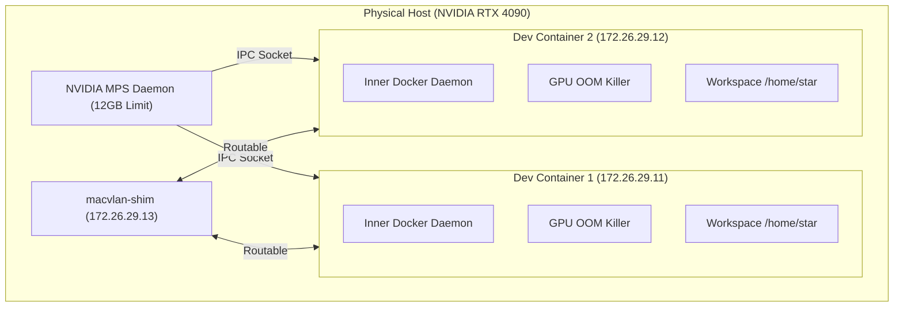

# 🌟 STAR: Enterprise Docker Dev Environment Architecture

## 📋 Executive Summary
The **STAR** (Isolated Docker Development Environment) is a high-performance, containerized infrastructure designed to provide developers with fully isolated, production-grade environments. It leverages **macvlan** networking for native IP addressing and **NVIDIA Multi-Process Service (MPS)** for fine-grained GPU resource partitioning. 

This solution solves the "noisy neighbor" problem in shared GPU servers by enforcing strict hardware-level memory limits and providing a unique "Global GPU OOM Killer" for nested Docker-in-Docker (DinD) workloads.

---

## 🏗️ System Architecture

### High-Level Orchestration
The following diagram illustrates how the host resources are partitioned and delivered to the development containers.

---

## 🚀 Core Technologies

### 1. Networking: macvlan & Shim
Unlike standard Docker bridges that use NAT, STAR utilizes the `macvlan` driver.
- **Dedicated IPs**: Each container appears as a physical device on the network with its own MAC and IP address.
- **Protocol Support**: Full support for FTP, SSH, and custom protocols without complex port mapping.
- **The Shim Interface**: Since the Linux kernel prevents host-to-macvlan communication by default, we implement a **macvlan-shim** on the host. This creates a bridge that allows the host (and management scripts) to talk directly to the containers.

### 2. Compute: NVIDIA MPS Isolation
To share a single GPU (e.g., a 24GB RTX 4090) between two environments without one crashing the other:
- **MPS Daemon**: Runs on the host and manages GPU context switching.
- **Memory Hard-Limits**: Enforced via `CUDA_MPS_PINNED_DEVICE_MEM_LIMIT`. Each container is strictly capped at **12GB VRAM**.
- **Execution Partitioning**: Each container is allocated **50% of the GPU's compute threads**, ensuring fair performance distribution.

### 3. Resilience: Global GPU OOM Killer
A major innovation in this stack is the `dind_oom_killer.sh`. Standard Docker memory limits do not propagate correctly into nested (DinD) containers. 
- **The Problem**: A user running `docker run --gpus all` inside their dev environment could bypass parent limits.
- **The Solution**: A background daemon monitors aggregate GPU usage. If the total usage within a dev environment exceeds its 12GB quota, the killer identifies the specific nested container responsible (via cgroup mapping) and terminates it instantly to protect host stability.

---

## 🛠️ Implementation Details

### File Structure
- `Dockerfile`: Multi-stage build based on `nvidia/cuda:12.2.0`, hardened with SSH and built-in Docker Engine.
- `docker-compose.yml`: Defines the two environments (`dev1`, `dev2`) with their specific network and GPU constraints.
- `/scripts/`: Modular management system.
  - `setup-host.sh`: Prerequisite installation.
  - `deploy.sh`: Pre-flight checks and orchestrated startup.
  - `manage.sh`: CLI for daily operations.

### Resource Allocation Matrix
| Resource | Per Container | Total (Max) | Enforcement |
| :--- | :--- | :--- | :--- |
| **CPU** | 8 Cores | 16 Cores | Docker Cgroups |
| **RAM** | 64 GB | 128 GB | Docker Cgroups |
| **GPU VRAM** | 12 GB | 24 GB | NVIDIA MPS |
| **GPU Threads** | 50% | 100% | NVIDIA MPS |

---

## 📖 Operational Guide

### Deployment Workflow
1. **Host Setup**: Run `sudo ./scripts/setup-host.sh` to install Docker and NVIDIA toolkits.
2. **Network Setup**: Run `sudo ./scripts/setup-macvlan.sh` to initialize the physical bridge.
3. **Hardware Initialization**: Run `sudo ./scripts/start-mps.sh` to start the GPU manager.
4. **Environment Launch**: Run `./scripts/deploy.sh` to build and spin up the containers.

### Management Commands
Using the `./scripts/manage.sh` utility:
- `status`: View IP addresses and container health.
- `gpu-status`: Verify MPS communication and VRAM availability.
- `rebuild`: Perform a clean wipe of images and redeploy.
- `ssh-config`: Generate the boilerplate for your `~/.ssh/config`.

---

## 🔒 Security & Data Persistence

### Data Strategy
- **Workspaces**: Mounted to persistent Docker volumes. Source code persists across container deletions.
- **Home Directories**: Isolated `.bashrc`, `.ssh`, and config files.
- **Docker-in-Docker Cache**: Each environment has its own `/var/lib/docker` volume, preventing image bloat on the host while ensuring fast container starts inside the dev environment.

### Hardening
- **CDI Sanitization**: On every startup, the `entrypoint.sh` generates a custom Container Device Interface (CDI) spec. This ensures only necessary GPU nodes are passed through, preventing system-level escapes via the NVIDIA driver.
- **SSH Hardening**: Custom `sshd_config` with protocol level 2 and restricted authentication paths.

---

> [!TIP]
> **Developer Tip**: For the best experience, use **VS Code Remote - SSH**. The environment is optimized to allow seamless IDE integration, making it feel like you are coding locally while utilizing 4090-grade hardware.
